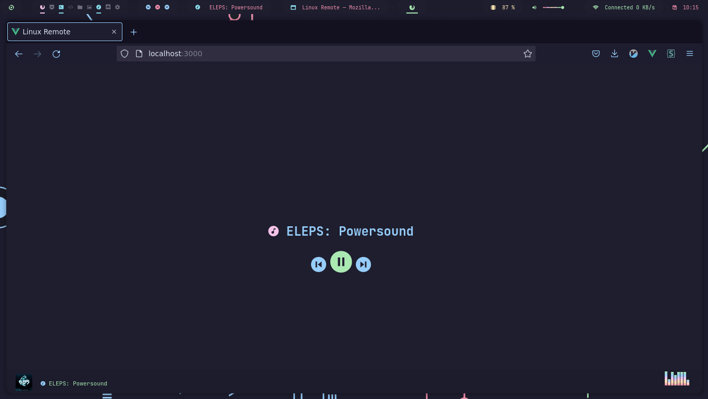

# Linux Remote

This is a web based application that uses playerctl in it backend to control remotely
your audio using the frontend as remote control.



## Downloading and setup

First download with git

```sh
git clone https://github.com/AlphaTechnolog/linux-remote
```

Then install dependencies for backend and frontend

```sh
cd linux-remote
cd api
npm install
cd ../app
npm install
cd ../
```

## Running the backend

First copy the `.env.sample` file to `.env`

```sh
cd linux-remote/api
cp -r ./.env.sample ./.env
```

To run the backend simply run the start script:

```sh
npm start
```

## Running the frontend

First copy the configuration for the api example and replace values with the correct:

```sh
cd linux-remote/app
cp -r ./src/api/conf.sample.json ./src/api/conf.json
```

Then build the application:

```sh
npm run build
```

Then install `serve` to make an http server:

```sh
sudo npm install -g serve
```

And execute this to make the server works:

```sh
cd dist
serve
```

> If you want you can use apache, simply put the dist folder content to the root of the apache folder

## Running application for development

Use the `start.sh` script:

```sh
cd linux-remote
bash start.sh
```
